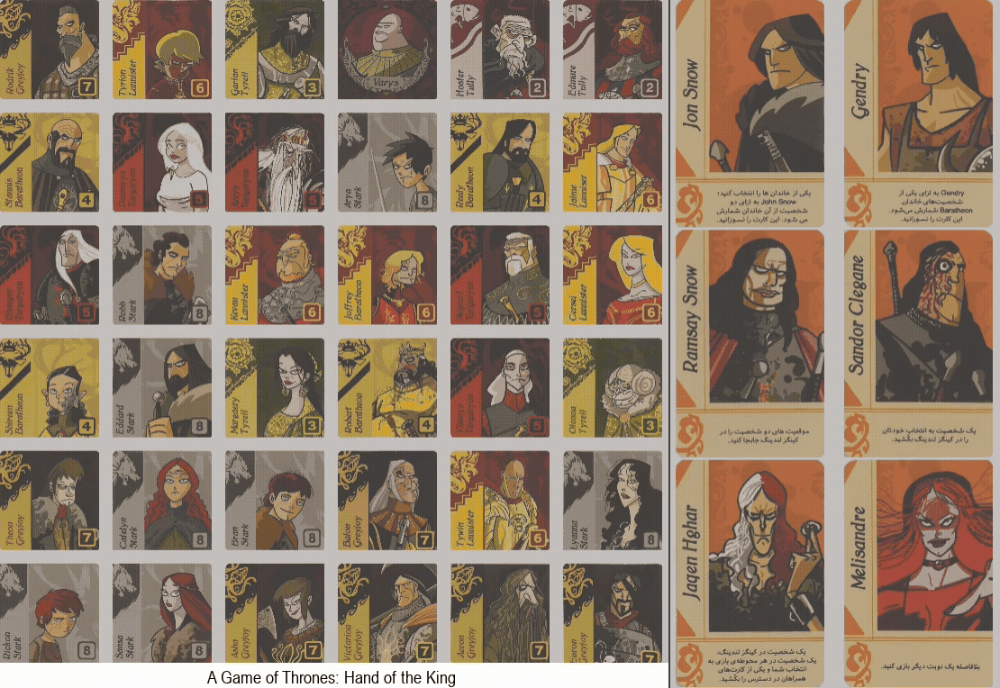

# 👑 A Game of Thrones: Hand of the King

This project is a Python-based implementation of the card game **"A Game of Thrones: Hand of the King."** The game is built with a Pygame interface and features a pluggable architecture for creating and competing with different AI agents.

You can play as a human against an AI, or pit two AI agents against each other to see whose strategy prevails in the quest for control over the Great Houses of Westeros.

## 🚀 Features

  * **Graphical Interface**: A clean and intuitive GUI built with Pygame.
  * **Human vs. AI & AI vs. AI**: Play against an included agent or watch two AIs battle for the Iron Throne.
  * **Multiple AI Agents**: Comes with several agents, including:
      * A **Random Agent** that makes random valid moves.
      * A **Minimax Agent** that uses the minimax algorithm with alpha-beta pruning to find the optimal move.
  * **Game State Management**: Save and load specific board layouts for testing and analysis.
  * **Video Recording**: Automatically save a video of each match to review later.

-----

## 📜 Game Rules

The goal of the game is to collect the most banners from the Great Houses of Westeros.

1.  **The Board**: The game is played on a 6x6 grid of character cards. The special card, **Varys**, starts on one of these squares.
2.  **Making a Move**: On your turn, you must choose another character card in the **same row or column** as Varys. Varys then moves to that character's location.
3.  **Capturing Cards**: When you choose a character, you capture that card. You also capture **all other cards of the same House** that lie between Varys's original position and his new position.
4.  **Claiming Banners**: The moment you have more cards of a particular House than your opponent, you claim that House's banner. If you are tied, the banner goes to the player who last captured a card from that House.
5.  **Companions**: If your move results in all cards of a House being removed from the board, you get to choose and use a **Companion card**. Companions have powerful, unique abilities that can change the course of the game.
6.  **Winning the Game**: The game ends when no legal moves can be made. The player with the most banners wins\!

-----

## ♟️ Gameplay Demo

Here is a sample match between two AI agents, showcasing the game's flow and graphical interface.



-----

## 🔧 Technologies Used

  * **Python**
  * **Pygame**: For the graphical user interface and event handling.
  * **MoviePy**: For saving gameplay videos.

-----

## 📂 Project Structure

The repository is organized as follows:

```
.
├── assets/
│   ├── characters.json         # Data for all character and companion cards
│   ├── cards/                  # Images for character cards
│   ├── companions/             # Images for companion cards
│   └── ...                     # Other graphical assets
├── utils/
│   ├── classes.py              # Defines the main Card and Player classes
│   └── pygraphics.py           # Handles all Pygame rendering and user input
├── videos/                     # Default output directory for saved game videos
├── boards/                     # Default directory for saved board states
│
├── main.py                     # The main game engine and entry point
├── random_agent.py             # An AI that makes random moves
├── mini_max.py                 # An AI using the Minimax algorithm
├── gen_mini_max.py             # A genetically tuned Minimax agent
└── ...                         # Your other agent files
```

-----

## ⚙️ Setup and Usage

### Prerequisites

  * Python 3.x
  * pip

### Installation

1.  **Clone the repository:**

    ```sh
    git clone https://github.com/Mohammad-Momeni/Hand-of-the-King/
    cd Hand-of-the-King
    ```

2.  **Install the required libraries:**

    ```sh
    pip install pygame moviepy
    ```

### How to Run the Game

You can run the game from the command line, specifying which agent (or human) controls each player.

**Run a Human vs. AI Game:**
Let the human be Player 1 and the `random_agent` be Player 2.

```sh
python main.py --player1 human --player2 random_agent
```

**Run an AI vs. AI Game:**
Watch the `mini_max` agent play against the `random_agent`.

```sh
python main.py --player1 mini_max --player2 random_agent
```

**Command-Line Arguments:**

  * `--player1 <name>`: Set Player 1. Use `human` or the name of an agent file (e.g., `mini_max`).
  * `--player2 <name>`: Set Player 2.
  * `-s <filename>`: **Save** the randomly generated board state to a file in the `/boards` directory.
  * `-l <filename>`: **Load** a specific board state from a file.
  * `-v <filename>`: **Save the video** of the match with a custom name. If not specified, a default name is generated (e.g., `mini_max_vs_random_agent.mp4`).

-----

## 🤖 How to Create Your Own AI Agent

You can easily create your own agent by following these steps:

1.  Create a new Python file (e.g., `my_awesome_agent.py`).

2.  Implement a `get_move` function in that file with the following signature:

    ```python
    def get_move(cards, player1, player2, companion_cards, choose_companion):
        '''
        Calculates the best move for the agent.

        Parameters:
            cards (list): A list of Card objects currently on the board.
            player1 (Player): The Player object for the current agent.
            player2 (Player): The Player object for the opponent.
            companion_cards (dict): A dictionary of available companion cards.
            choose_companion (bool): True if the agent MUST choose a companion.

        Returns:
            - An integer (location) for a normal move.
            - A list (e.g., ['Jon', 15]) for a companion move.
        '''
        # Your logic goes here
        # ...
        best_move = # ...
        return best_move
    ```

3.  Run your agent from the command line:

    ```sh
    python main.py --player1 my_awesome_agent --player2 random_agent
    ```
